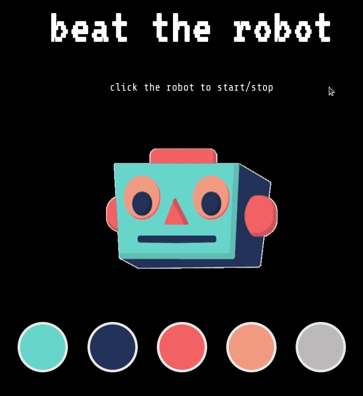

# Pre-work - *Memory Game*

**Memory Game** is a Light & Sound Memory game to apply for CodePath's SITE Program. 

Submitted by: Angel Otero

Time spent: 10 hours spent in total

Link to project: https://glitch.com/edit/#!/simplistic-bumpy-temple

## Required Functionality

The following **required** functionality is complete:

* [x] Game interface has a heading (h1 tag), a line of body text (p tag), and four buttons that match the demo app
* [x] "Start" button toggles between "Start" and "Stop" when clicked. 
* [x] Game buttons each light up and play a sound when clicked. 
* [x] Computer plays back sequence of clues including sound and visual cue for each button
* [x] Play progresses to the next turn (the user gets the next step in the pattern) after a correct guess. 
* [x] User wins the game after guessing a complete pattern
* [x] User loses the game after an incorrect guess

The following **optional** features are implemented:

* [x] Any HTML page elements (including game buttons) has been styled differently than in the tutorial
* [x] Buttons use a pitch (frequency) other than the ones in the tutorial
* [x] More than 4 functional game buttons
* [x] Playback speeds up on each turn
* [x] Computer picks a different pattern each time the game is played
* [ ] Player only loses after 3 mistakes (instead of on the first mistake)
* [ ] Game button appearance change goes beyond color (e.g. add an image)
* [ ] Game button sound is more complex than a single tone (e.g. an audio file, a chord, a sequence of multiple tones)
* [ ] User has a limited amount of time to enter their guess on each turn

The following **additional** features are implemented:

- [x] Melody plays when starting/ending game (different melodies).
- [x] Melody plays when winning/losing game (different melodies).
- [x] Start/end button is animated.
- [x] Start/end button changes appearance on mouse hover.
- [x] Start/end button changes appearance when user is playing/making progress/wins/loses.
- [x] Page captions change when user is playing/wins/loses.
- [x] Button frequencies changed to match C minor pentatonic scale.
- [x] Buttons change appearance on mouse hover/active.

## Video Walkthrough (GIF)

## Reflection Questions
1. If you used any outside resources to help complete your submission (websites, books, people, etc) list them here. 

- https://www.w3schools.com/js/js_syntax.asp - Used to reference JavaScript syntax and documentation.
- https://pages.mtu.edu/~suits/notefreqs.html  - Used to get the frequency in Hz of musical notes/forumla to calculate an octave from a given note.
- https://www.canva.com/ - Used to get the videos of the robot's faces.
- https://ezgif.com - Used to convert the robot's faces videos into GIF files.
- Peek software (https://github.com/phw/peek) - Used to record the game GIFs.
- Color Picker software (https://hjdskes.nl/projects/gcolor3) - Used to get HEX value of colors displayed in the screen.

2. What was a challenge you encountered in creating this submission (be specific)? How did you overcome it? (recommended 200 - 400 words) 

- For this project I used JavaScript to manipulate the captions displayed in the page as well as GIF images used for the start/stop button; these elements change depending on specific actions and game states — starting/ending the game, on mouse hover and when the player wins or loses the game. Since I did not know how any JavaScript prior to the start of this project, these tasks challenged me to look at syntax documentation to learn how to implement JavaScript's object specific functions such as getEelementById and setAttribute, fortunately, JavaScript's syntax resembles Java's syntax so the use of classes and methods was not completely foreign to me. 

- What I found more challenging, however, was the proper use of the setTimeout method, which functionality was completely new to me. Somewhere in the process of finishing the game's functionality it occurred to me to implement different melodies to play when the user clicks on the start/end button and when the user won/lost the game, so I created a set of functions for each different melody I wanted to be played. First, I tried using the playTone method provided in the instructions sequentially when the game was started.

- After testing the method, I realized that only the last note was playing, so I took a closer look at the playClueSequence method to try to reverse engineer its functionality. I noticed the setTimeout function was being used inside a for loop to play the notes given by the pattern of notes initialized at the start of the game. Then, I tried using said function in my methods, but I could not get them to work; what really confused me was the way the parameters of the setTimeout function worked when passing a function that takes other parameters as one. Thankfully, I could find the proper documentation of this function, and, after experimenting with the delay parameter for a while, I could finally understand how to correctly impelement the method.

3. What questions about web development do you have after completing your submission? (recommended 100 - 300 words) 

- I recently had a team project presentation where my team and I demoed a website we created using HTML and CSS. We were tasked to each design a route of the website and merge our individual designs to create a cohesive page. After spending hours meticulously designing each component of my page, I noticed that when my teammate used his computer to open the website, my page looked completely different — various elements were displayed outside their respective containers and the images where displayed at different resolutions. 

- After doing some research online, I learned about the concept of responsive web design, but since I just recently started learning web design, I am still not sure how to implement responsive layouts in my projects. I tried addressing these issues in this project by setting the size and location of elements with percentages instead of specific pixel sizes, but I would like to know the different techniques to efficiently create a responsive website.

4. If you had a few more hours to work on this project, what would you spend them doing (for example: refactoring certain functions, adding additional features, etc). Be specific. (recommended 100 - 300 words) 

- If I had more time to work in this game I would like to implement difficulty selector that changed certain game parameters based on the chosen difficulty. 
- For an easy difficulty, I would decrease the number of turns to 8 instead of 10 and the value of the clueHoldTime and cluePauseTime variables. 
- The medium difficulty would be the way the game is currently set. And the option for the hard difficulty would only be displayed as an extra button after a user beats the robot one time in the medium difficulty.
- For the hard difficulty I would increase the turns to 15, and I would implement a function that moves the buttons to a random location in the screen on mouse hover, this would create a sense that the robot is cheating to win, which would increase the rate of losing the game, hence increase the replay value and overall fun.

## Interview Recording URL Link

[My 5-minute Interview Recording](https://www.loom.com/share/fc57e77fc91f4240b539597e70754b25)

## License

    Copyright [YOUR NAME]

    Licensed under the Apache License, Version 2.0 (the "License");
    you may not use this file except in compliance with the License.
    You may obtain a copy of the License at

        http://www.apache.org/licenses/LICENSE-2.0

    Unless required by applicable law or agreed to in writing, software
    distributed under the License is distributed on an "AS IS" BASIS,
    WITHOUT WARRANTIES OR CONDITIONS OF ANY KIND, either express or implied.
    See the License for the specific language governing permissions and
    limitations under the License.
